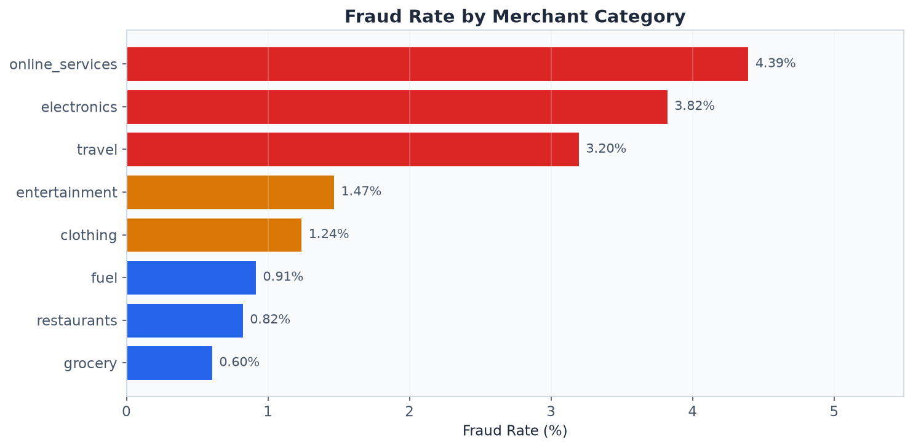
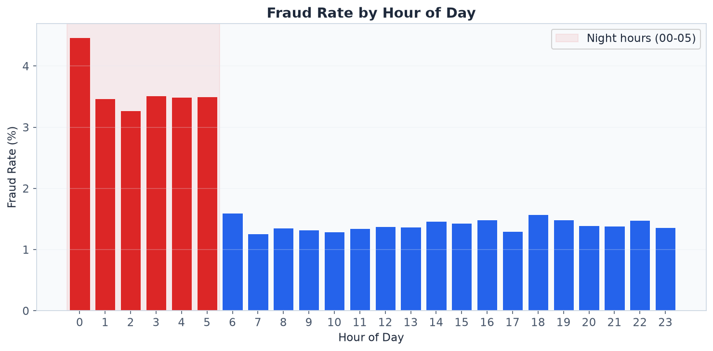
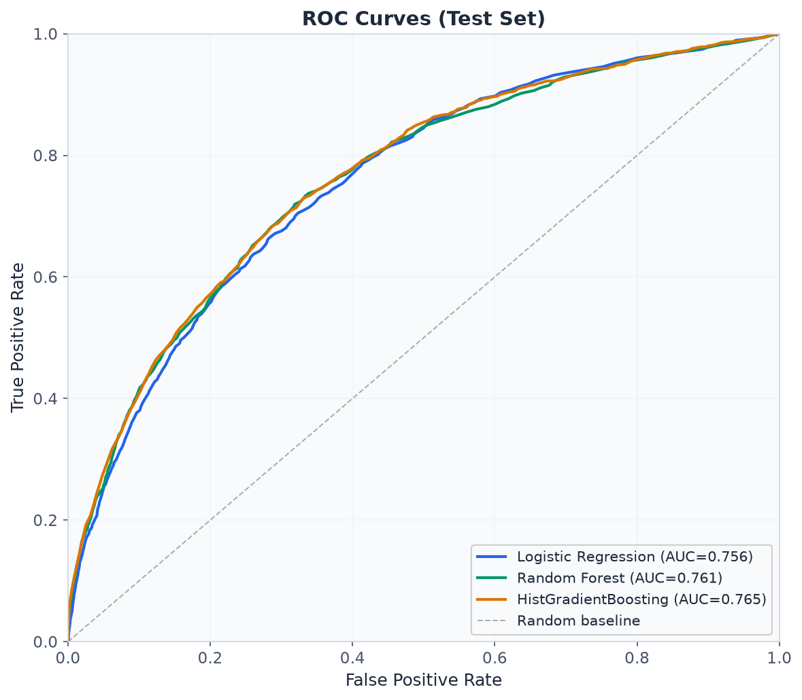
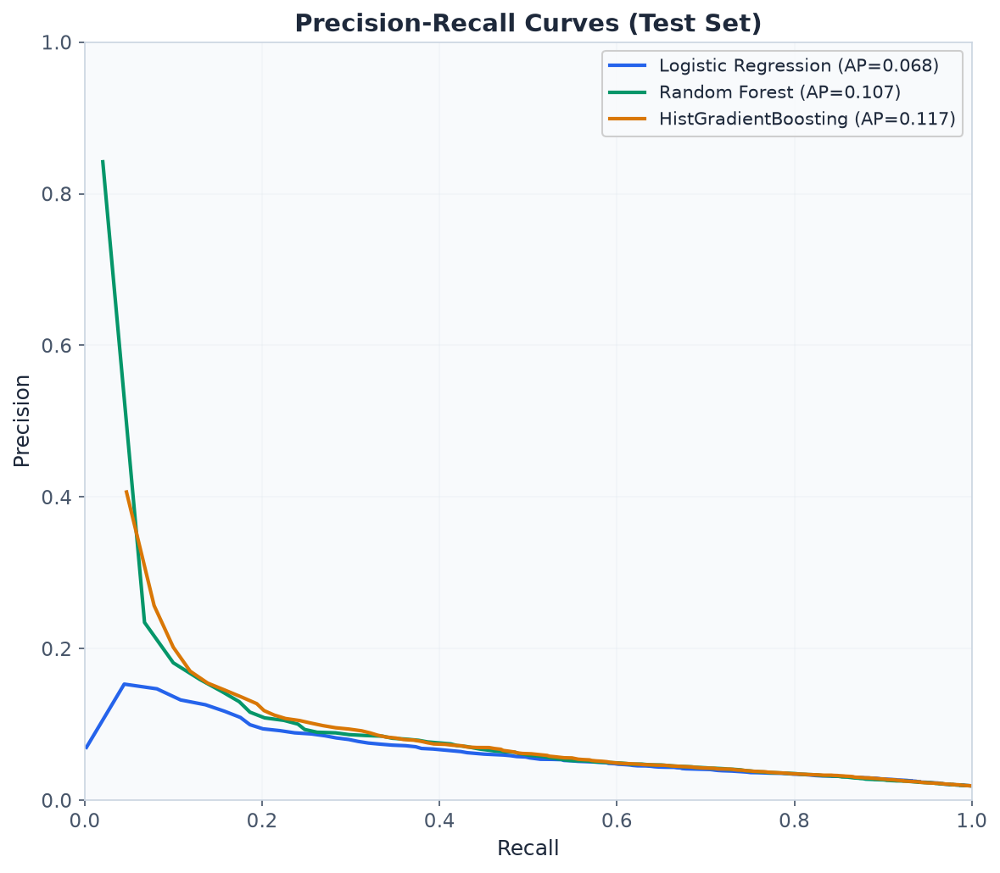
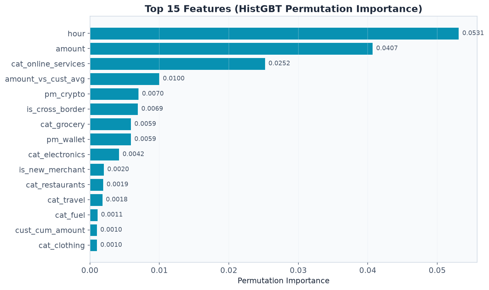
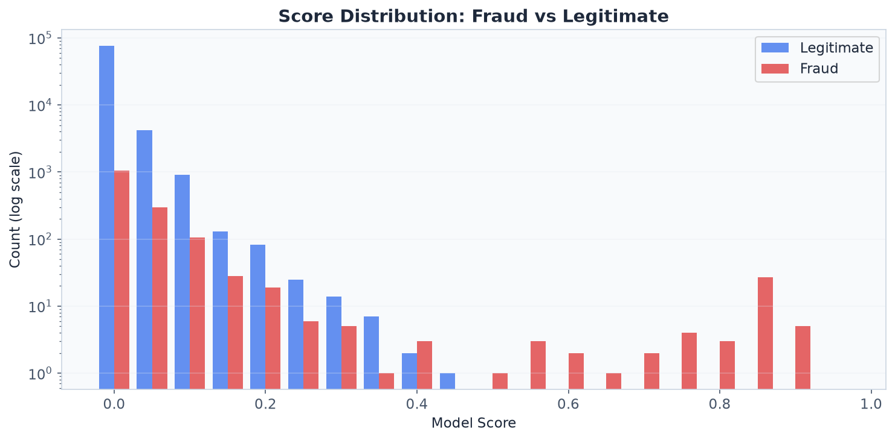
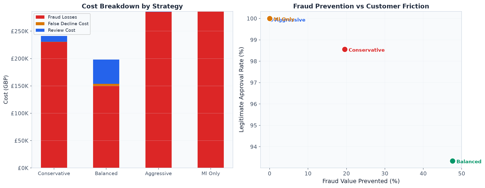
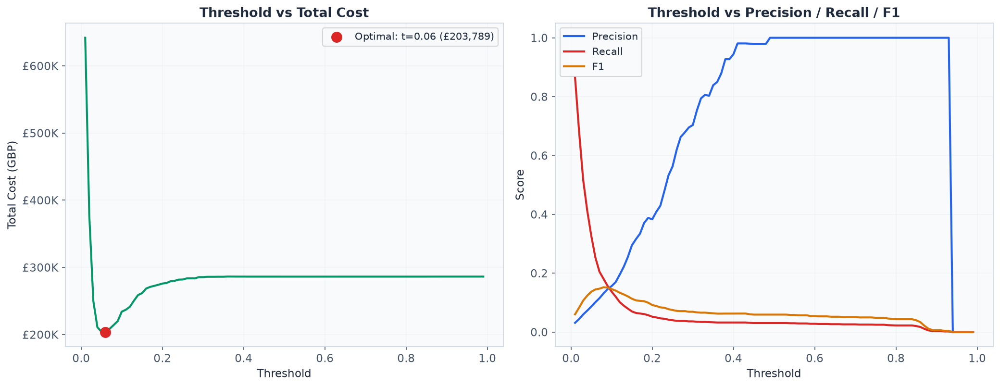

# Payments Fraud & Risk Decisioning Engine

End-to-end fraud detection and risk decisioning pipeline for payment transactions, featuring synthetic data generation, SQL analysis, rule-based detection, ML model training, cost-sensitive threshold optimization, and an interactive HTML dashboard.

## Key Results

| Metric | Value |
|--------|-------|
| Dataset | 500K synthetic transactions, 6 months |
| Fraud Rate | ~1.96% (realistic CNP rate) |
| Best Model | HistGradientBoosting (ROC-AUC 0.765, PR-AUC 0.117) |
| Cost-Optimal Strategy | 3-way decisioning (APPROVE/REVIEW/DECLINE) |
| Fraud Value Prevented | 47.6% (balanced strategy) |
| Legitimate Approval Rate | 93.3% |

## Fraud Patterns

The synthetic dataset embeds realistic fraud signals: night-time activity, high-risk categories, crypto payments, and velocity bursts.

<p align="center">
  
  
</p>

Online services (4.4%), electronics (3.8%), and travel (3.2%) carry the highest fraud rates. Night hours (00:00-05:00) show a 3.6% fraud rate, over 2.5x the daytime average.

## Model Performance

Three models trained with time-based split (months 1-4 train, 5 validation, 6 test) and class-balanced weighting.

<p align="center">
  
  
</p>

| Model | Precision | Recall | F1 | ROC-AUC | PR-AUC |
|-------|-----------|--------|----|---------|---------| 
| Logistic Regression | 0.044 | 0.642 | 0.083 | 0.756 | 0.068 |
| Random Forest | 0.051 | 0.571 | 0.094 | 0.761 | 0.107 |
| HistGradientBoosting | 1.000 | 0.030 | 0.059 | 0.765 | 0.117 |

### Feature Importance

Permutation importance on the HistGBT model reveals hour of day and transaction amount as the strongest fraud predictors.

<p align="center">
  
</p>

### Score Distribution

<p align="center">
  
</p>

## Cost-Sensitive Decision Strategy

A cost model (fraud approved = 100% txn value, legit declined = GBP 15, manual review = GBP 8) drives threshold optimization and 3-way decisioning.

<p align="center">
  
</p>

| Strategy | Fraud Prevented | Legit Approval | Total Cost |
|----------|----------------|----------------|------------|
| Conservative | 19.6% | 98.6% | GBP 241,117 |
| **Balanced** | **47.6%** | **93.3%** | **GBP 198,326** |
| Aggressive | 0.3% | 100.0% | GBP 285,716 |
| ML-only (binary) | 0.0% | 100.0% | GBP 286,252 |

### Threshold Optimization

<p align="center">
  
</p>

## Project Structure

```
├── notebooks/                    # Execution pipeline (run in order)
│   ├── 00_generate_dataset.py    # Synthetic data with embedded fraud patterns
│   ├── 01_data_quality.py        # Data profiling and quality checks
│   ├── 02_eda.py                 # Exploratory data analysis
│   ├── 03_feature_engineering.py # 28 leak-free features
│   ├── 04_sql_analysis.py        # 13 DuckDB analytical queries
│   ├── 05_rule_engine.py         # 10 deterministic fraud rules
│   ├── 06_ml_training.py         # LogReg, RF, HistGBT with time-split
│   ├── 07_threshold_and_strategy.py # Cost-sensitive 3-way decisioning
│   ├── 08_explainability_monitoring.py # Feature importance, FP/FN analysis, PSI
│   ├── 09_build_dashboard.py     # Generates interactive HTML dashboard
│   └── 10_generate_plots.py      # Generates README plots
├── src/
│   └── rule_definitions.json     # Human-readable rule descriptions
├── sql/                          # 13 standalone SQL queries
├── data/
│   ├── raw/transactions.csv      # 500K raw transactions (regenerate via 00_)
│   └── processed/                # Feature-engineered datasets
├── dashboard/
│   └── dashboard.html            # 5-tab interactive dashboard (open in browser)
├── assets/                       # Plot images for README
├── outputs/                      # JSON results from each phase
│   └── models/                   # Trained model pickles
└── docs/
    └── methodology.md            # Technical methodology
```

## Dashboard

Download and open `dashboard/dashboard.html` in any browser.

**5 tabs:**
1. **Overview** — KPIs, daily fraud rate, monthly volume, category and payment breakdowns
2. **Fraud Patterns** — Hourly/daily patterns, amount distributions, country analysis, top fraud customers
3. **Model Performance** — ROC/PR curves, feature importance, score distributions, rule engine comparison, FP/FN profiles
4. **Decision Strategy** — 4 strategy comparison (conservative/balanced/aggressive/ML-only), cost breakdowns, drift monitoring
5. **Threshold Simulator** — Interactive sliders for review/decline thresholds with real-time cost and metric updates

## Methodology

### Synthetic Data Generation
- 10,000 customers with spending profiles, 2,000 merchants across 8 categories
- Fraud patterns: velocity bursts, unusual amounts, night-time activity, cross-border, card testing
- Power-law customer frequency distribution (realistic transaction clustering)

### Feature Engineering (28 features, leak-free)
- **Temporal**: hour, day of week, weekend flag, night flag, month
- **Amount**: log-transformed, deviation from customer average
- **Velocity**: 1-hour and 24-hour rolling transaction counts
- **Behavioral**: new merchant flag, cross-border flag
- **Categorical**: one-hot encoded merchant category and payment method

### 3-Way Decisioning
Transactions are routed to APPROVE, REVIEW, or DECLINE based on two score thresholds, optimized against a cost model that balances fraud losses with customer friction.

## Tech Stack

- **Python** (pandas, numpy, scikit-learn, DuckDB, matplotlib)
- **HTML/CSS/JS** (Chart.js) — standalone dashboard, no server
- **DuckDB** — SQL analytics on CSV files

## Running the Pipeline

```bash
pip install pandas numpy scikit-learn duckdb matplotlib

# Run all phases in order
python notebooks/00_generate_dataset.py
python notebooks/01_data_quality.py
python notebooks/02_eda.py
python notebooks/03_feature_engineering.py
python notebooks/04_sql_analysis.py
python notebooks/05_rule_engine.py
python notebooks/06_ml_training.py
python notebooks/07_threshold_and_strategy.py
python notebooks/08_explainability_monitoring.py
python notebooks/09_build_dashboard.py
python notebooks/10_generate_plots.py
```

## Author

**Gagandeep Kapoor** — Warwick MEng Mechanical Engineering

---
*Built with synthetic data for demonstration purposes. No real financial data was used.*
